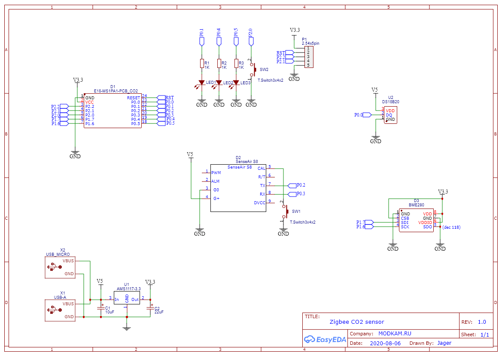
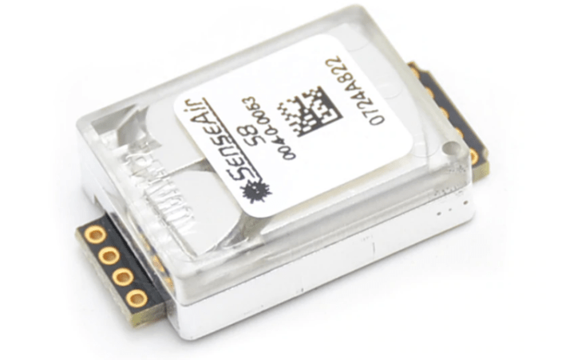
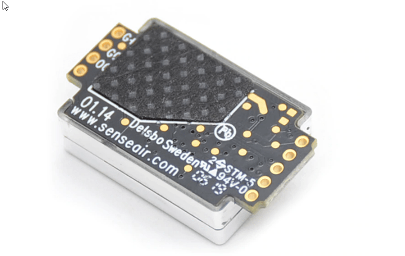
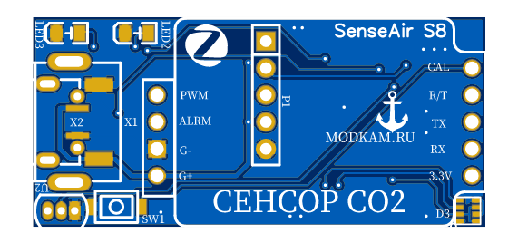
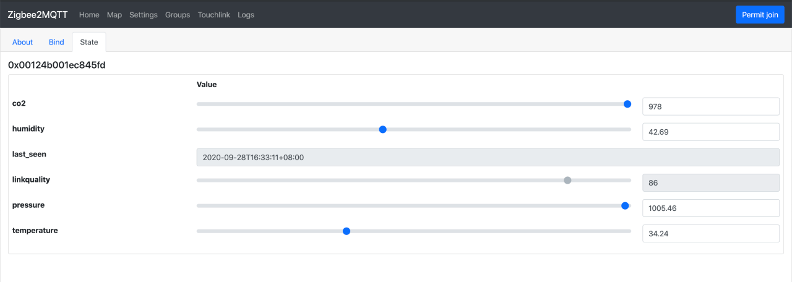
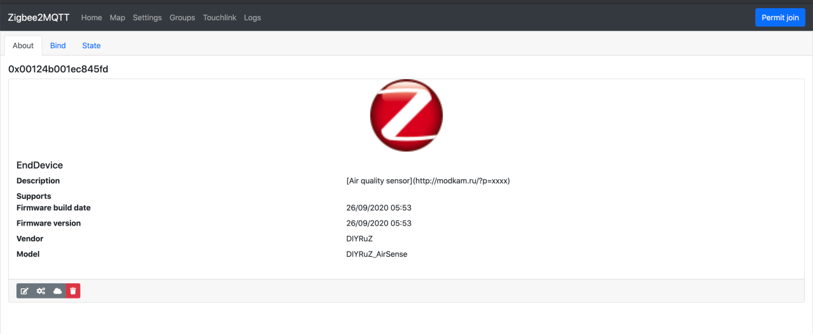
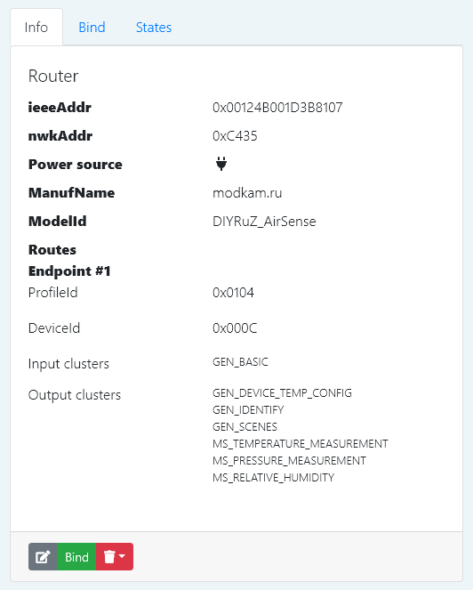
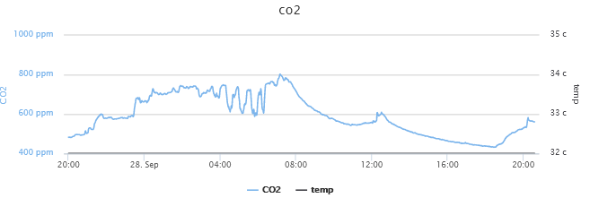
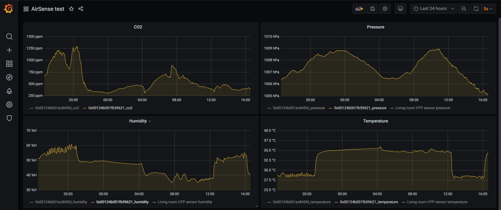

# Air quality sensor

  
Carbon dioxide has a very negative effect on the human body and is a carcinogen. Being in a room with a high concentration of CO2 can cause weakness, drowsiness, headaches, and problems concentrating. In this regard, it is necessary to monitor the level of CO2 and take measures to reduce it.

Today there are several options available for CO2 measurement, the most interesting being the SenseAir S8. His readings will be displayed on the Zigbee network.

### Diagram
  

The Zigbee part is implemented on the E18-MS1PA1-PCB module, besides it, the board contains the SenseAir S8 CO2 sensor itself  
   
   
and two variants of temperature sensors, this is the DS18B20 and the more universal BME280 sensor, which allows you to measure temperature, humidity and atmospheric pressure.

### PCB
The board is designed in the popular "usb stick" form factor, you can unsolder both micro USB and USB-A connectors   

The assembly of the device should not cause difficulties even for people with initial soldering skills, all elements are large enough, with the exception of the BME280.

When assembled, the device looks like this, please note that a gap must be left between the SenseAir S8 and the board.  

Anonymass wrote the firmware for this device, it is open source.  

### Support
The sensor is supported in the zigbee2mqtt via interval and external converter. It looks like this  
  

also implemented support in SLS Gateway
  

According to the test results, the high sensitivity of SenseAir S8 was found, the sensor quickly responds to changes in the CO2 level.

Jager's daily schedule.  

Anonymass' daily schedule.  

### Other info
* The MHZ19B sensor (and clones) also can be installed on the board.
* End devices use sleep mode, so E18 board stays cold and BME280 shows more truthful values.

### How to join
 * Reset to FN rebooting device 5 times with interval less than 10 seconds, led will start flashing during reset  
 * Reset to FN by pressing and holding button(1) 5 seconds

### User interface
#### LEDs
* LED1 blinks when accessing the CO2 sensor.
* LED2 blinks if the CO2 value is higher than the first set point (1000), while LED3 is off.
* LED3 blinks if the CO2 value is higher than the second set point (2000), while LED2 is on.

#### Buttons
* SW2 E18 Manual report / FN reset
* SW1 CO2 Calibration

### Files to reproduce
* [Gerbers and BOM](https://github.com/diyruz/AirSense/tree/master/hardware)
* [Firmware](https://github.com/diyruz/AirSense/releases)

[Original post by Jager](https://modkam.ru/?p=1715)  